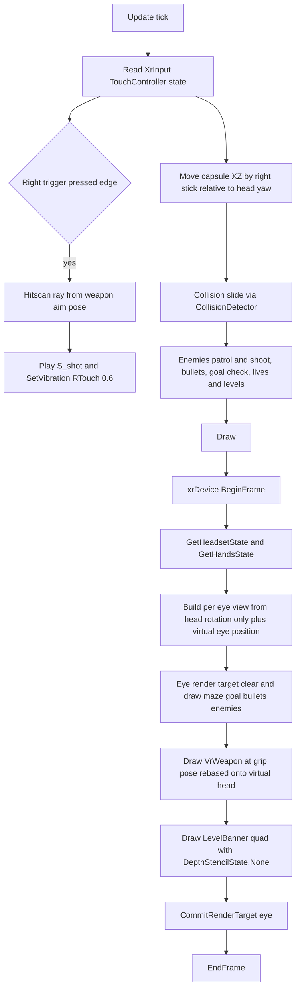

# ShittyMaze → PICO 4 VR Adaptation Plan

Branch: `PICO4-VR` (already checked out). All changes land **inside this repo only**.
`ShittyMazeVr/` (workspace sibling) is used strictly as the reference for the build pipeline and OpenXR setup; `kni/` (patched branch `pico-openxr-fix`) and `LibOXR/` (patched branch `android-create-instance-chain`) are consumed as-is — **no changes to them**.

---

## 1. Repo inventory & how things work today

### 1.1 ShittyMaze (this repo)

| Item | Path | Notes |
|---|---|---|
| Solution | `PrettyShitty.sln` | 2 projects: `Maze3D` + `Web`. |
| Core library | `Maze3D/Maze3D.csproj` | net8.0, **nuget** `nkast.Xna.Framework.* 4.2.9001`, `Labyrinthian 1.4.0`. |
| Game loop | `Maze3D/Core/Game1.cs` | Full gameplay: levels, lives, enemies, shooting, HUD overlays. Web-only host. |
| Camera | `Maze3D/Core/Camera.cs` | Euler yaw/pitch, pitch clamped ±45°, FOV 90°, `GetForwardDirection()` is XZ-only. |
| Player | `Maze3D/Entities/Player.cs` | Just `Position` + `Speed = 5.0f`. |
| Enemies | `Maze3D/Entities/Enemy.cs` | Billboard quad, straight patrol path, 3s shot cooldown, red damage tint via `BasicEffect.DiffuseColor`. |
| Bullets | `Maze3D/Entities/Projectile.cs` | Cube, XZ travel, precomputed wall-despawn distance. |
| Goal | `Maze3D/Entities/GoalObject.cs` | Green spinning cube, `CheckCollision(playerPos)`. |
| Maze | `Maze3D/Maze/MazeData.cs`, `MazeGenerator.cs` | Labyrinthian Prim → 21×21 grid (10×10 cells), cell = 2.0 m, walls 2.0 m tall; DDA line-of-sight + ray-wall-hit helpers. |
| Collision | `Maze3D/Physics/CollisionDetector.cs` | XZ sphere-vs-wall-cells, player radius 0.3. |
| Renderer | `Maze3D/Graphics/MazeRenderer.cs` | VertexPositionColorTexture buffers + BasicEffect, `Draw(view, projection)` — already camera-agnostic, per-eye call ready. |
| Web host | `Web/` (Blazor WASM, `Pages/Index.razor.cs`) | JS interop: `ApplyMouseDelta`, `RequestShoot`, `TickDotNet`; content at `Web/Content/Content.mgcb` (platform BlazorGL). |
| Pistol asset | `new-assets/tt_33/scene.gltf` (+ `scene.bin`, 3 PNGs) | glTF 2.0: 5 meshes / 1 primitive each, all sharing 1 material `tt-33` (`doubleSided`, baseColor + MR + normal textures), POSITION/NORMAL/TANGENT/TEXCOORD_0, uint32 indices, node hierarchy with baked scale (5.535 → 0.01) and rotation matrices. Raw asset, **not** in any content pipeline. |

**Current behavior to replace (per requirements):**
- Auto-run: `Game1.HandleMovement` — W latches `isMoving=true`, character runs forward forever (S pauses while held).
- Weapon: fullscreen 2D overlay sprites `T_fullscreen_first_person_weapon*` (`DrawFirstPersonWeapon`), 1.0 s shot frame.
- HP: fullscreen hearts overlays `T_{1..3}_hearts` (`DrawHearts`), `lives` 3→0, 0 → `ResetOnDeath` (level 1, lives 3).
- Level text: `DrawLevelCounter` — SpriteFont string "Level N" top-center, permanent.

### 1.2 ShittyMazeVr (reference app — do not modify)

| Item | Path | What it proves |
|---|---|---|
| Project | `ShittyMazeVr/ShittyMazeVr.csproj` | net10.0-android, `SupportedOSPlatformVersion 29`, `KniPlatform=Android`, `EnableDefaultItems=false`, **ProjectReferences to `../kni/src/*` + `../kni/Platforms/Kni.Platform.Oculus.GL.csproj`** (source, not nuget), Builder nuget kept with `ExcludeAssets="compile;runtime"` to avoid assembly conflicts. |
| Game | `ShittyMazeVr/ShittyMazeVrGame.cs` | Full XR lifecycle: `XRDevice` ctor + `Services.AddService<XRDevice>`, `BeginSessionAsync(XRSessionMode.VR)`, `TrackFloorLevelAsync(true)` (try/catch), per-frame `BeginFrame → GetHeadsetState → foreach eye: GetEyeRenderTarget / GetEyeView / CreateProjection(eye, 0.05, 1000) / render / CommitRenderTarget → EndFrame`. GraphicsProfile.HiDef, 72 Hz target, `IsFixedTimeStep=false`. |
| Activity | `ShittyMazeVr/ShittyMazeVrActivity.cs` | `AndroidGameActivity` + `IMMERSIVE_HMD` / `com.oculus.intent.category.VR` intent categories. |
| Manifest | `ShittyMazeVr/AndroidManifest.xml` | minSdk 29 / target 34, `vr.headtracking` feature, `VIBRATE` permission. |
| SDK paths | `ShittyMazeVr/Directory.Build.props` | `AndroidSdkDirectory=d:\android-sdk`, `JavaSdkDirectory=d:\jdk`. |
| Content | `ShittyMazeVr/Content/ShittyMazeVrContent.mgcb` | `/platform:Android`, `/profile:Reach`. |
| Deploy | `ShittyMazeVr/deploy.ps1` | adb install + monkey launch loop. |
| Build cmd | root README | `dotnet build <csproj> -c Release -p:AndroidSdkDirectory=d:\android-sdk -p:JavaSdkDirectory=d:\jdk` → `bin/AnyCPU/Release/net10.0-android/*-Signed.apk` (build the **csproj directly**, not the sln, for Release). |

### 1.3 KNI XR API surface (facts that drive the design)

- `XRDevice` (`Microsoft.Xna.Framework.XR`, public): `BeginSessionAsync`, `BeginFrame`, `GetHeadsetState()`, `GetHandsState()`, `GetEyes()`, `GetEyeRenderTarget`, `CreateProjection`, `CommitRenderTarget`, `EndFrame`.
- `HeadsetState`: `HeadPose` + `LEyePose`/`REyePose` as `Pose3` (`Orientation` quaternion + `Translation`) in reference space. `GetEyeView(eye)` returns the full inverse pose — **includes real positional tracking**, which we must *not* use directly (requirement 1).
- `HandsState`: `L/RHandPose` (aim) + `L/RGripPose` (grip) + linear velocities — public pose data for controllers. **No buttons/sticks/haptics here.**
- **Controller input & haptics are exposed via `TouchController`** (`Microsoft.Xna.Framework.Input.XR`):
  - Wired automatically during session init: `kni/Platforms/XR/.Oculus/ConcreteXRDevice.cs` line ~1586 sets `TouchController.DeviceHandle = new ConcreteTouchControllerStrategy(this)` once the session reaches `Enabled`. **No reflection, no kni patch needed.**
  - `TouchController.GetState(TouchControllerType.RTouch)` → `GamePadState` with `.ThumbSticks.Right` (Vector2 = right thumbstick), `.Triggers.Right` (analog trigger 0..1), buttons A/B/stick-click, virtual trigger/grip/stick-direction buttons.
  - `TouchController.SetVibration(TouchControllerType.RTouch, amplitude)` → OpenXR `ApplyHapticFeedback` on `/user/hand/right/output/haptic`, fixed 3 kHz / 0.5 s.
  - Internally these poll OpenXR actions bound to `/interaction_profiles/oculus/touch_controller` (PICO 4 supports this compatibility profile); `_moveOnJoystickActionR` → `/user/hand/right/input/thumbstick`, `_moveOnYActionR` → `/user/hand/right/input/trigger/value`.
  - Caveat: `GetState` returns "disconnected" (empty state) unless the runtime's *current* interaction profile is exactly `oculus/touch_controller`.
- `Pose3` supports `Inverse`, `Multiply`, `Matrix.CreateFromPose` — enough to do all anchoring math with public API.
- Stereo path: eye render targets are created by the backend (1504×1504 per eye on PICO 4); GLES blit/commit handled by `CommitRenderTarget`.

---

## 2. Target architecture

### 2.1 Chosen approach — new `net10.0-android` entry project inside ShittyMaze

Add a new project **`Vr/ShittyMaze.Vr.csproj`** that:

1. Copies the *proven* ShittyMazeVr project skeleton (csproj flags, manifest, resources, SDK props, deploy script, mgcb with `/platform:Android`).
2. References the patched KNI **from source** (`../../kni/...` — paths go up from `ShittyMaze/Vr/` to the workspace root) exactly like the reference csproj, plus `Kni.Platform.Oculus.GL.csproj` (which itself pulls the patched local `LibOXR` project).
3. **Compiles the Maze3D sources directly** (`<Compile Include="../Maze3D/**/*.cs">`, `EnableDefaultItems=false`, excluding `obj/`/`bin/`), instead of a ProjectReference to `Maze3D.csproj`.
4. Contains only *new* VR-specific sources (game, camera rig, input wrapper, glTF loader, weapon, level banner).

**Why source-include instead of referencing/retargeting `Maze3D.csproj`:** Maze3D and Web are built against the **nuget** `nkast.Xna.Framework.* 4.2.9001` assemblies; the VR app must be built against the **source-built, patched** KNI assemblies (4.3.9001.0, different versions/identities). A ProjectReference from net10.0-android into the net8.0 Maze3D would drag the nuget XNA assemblies into the APK → duplicate `Xna.Framework.*` assemblies and type-identity conflicts. Source-inclusion compiles the same game code against the source-built assemblies and leaves `Maze3D.csproj` / `Web/` byte-for-byte untouched (web target keeps working, zero regression risk). This mirrors the pattern already proven by `ShittyMazeVr.csproj`. `Labyrinthian` is added as a plain nuget reference (netstandard2.0, no conflict).

Rejected alternatives:
- *Multi-target Maze3D (`net8.0;net10.0`) with conditional nuget/project refs*: works in principle but couples the web build to android workload availability and risks nuget/source assembly mixing in the IDE. Revisit later if the source-include gets unwieldy.
- *Second OpenXR instance via LibOXR for input*: PICO runtime rejects/confuses multiple sessions per process; and unnecessary — `TouchController` already exposes everything.

### 2.2 Project layout after the change

```
ShittyMaze/
├── PrettyShitty.sln                  # + Vr project entry (modified)
├── Maze3D/                           # UNTOUCHED (web keeps using it)
├── Web/                              # UNTOUCHED
├── new-assets/tt_33/                 # referenced as raw AndroidAssets by Vr
└── Vr/                               # NEW — everything below is new
    ├── ShittyMaze.Vr.csproj
    ├── Directory.Build.props         # AndroidSdkDirectory / JavaSdkDirectory
    ├── AndroidManifest.xml
    ├── deploy.ps1
    ├── Resources/ (Drawable/Icon.png, Drawable/Splash.png, Values/Strings.xml, Values/Styles.xml)
    ├── Content/VrContent.mgcb        # /platform:Android — textures, sounds, font (sources = ../../Web/wwwroot/Content/...)
    └── src/
        ├── MainActivity.cs           # AndroidGameActivity + IMMERSIVE_HMD
        ├── VrMazeGame.cs             # VR game loop (port of Game1 gameplay)
        ├── VrCameraRig.cs            # head-rotation-only stereo camera math
        ├── XrInput.cs                # TouchController wrapper (stick/trigger/vibration)
        ├── GltfModel.cs              # minimal runtime glTF loader
        ├── VrWeapon.cs               # 3D pistol on right hand + HP tint + cooldown
        └── LevelBanner.cs            # fading "Level N" quad, no depth test
```

### 2.3 Frame flow



---

## 3. Requirement designs

### 3.1 R1 — Input & camera (head rotation only, thumbstick movement)

**`VrCameraRig` (new).** Per frame, after `xrDevice.BeginFrame()` (in Draw):

- `HeadsetState hs = xrDevice.GetHeadsetState();`
- `headRot = hs.HeadPose.Orientation` — **discard `hs.HeadPose.Translation`** (real-world head translation must not move the player or camera).
- Virtual eye anchor: `eyeAnchor = (player.Position.X, EyeHeight, player.Position.Z)` with `EyeHeight = 1.5f` constant (walls are 2.0 m; old camera used 0.7 m which feels wrong in VR).
- Per-eye IPD-preserving view (stereo separation kept, translation ignored):
  - `eyeOffsetLocal = Vector3.Transform(eyePose.Translation - hs.HeadPose.Translation, Quaternion.Inverse(headRot))` (≈ ±0.032 m along head-right)
  - `eyeWorld = eyeAnchor + Vector3.Transform(eyeOffsetLocal, headRot)`
  - `view = Matrix.Invert(Matrix.CreateFromQuaternion(headRot) * Matrix.CreateTranslation(eyeWorld))`
  - `projection = xrDevice.CreateProjection(eye, 0.05f, 1000f)` (near 0.05 so the pistol at ~0.2–0.5 m doesn't clip).
- Exposes `VirtualHeadMatrix` (= rot * translation(eyeAnchor)) and `HeadForwardXZ`/`HeadRightXZ` for movement and weapon rebasing.

**`XrInput` (new).** Thin wrapper over `TouchController`:

- `Vector2 RightStick` — `TouchController.GetState(TouchControllerType.RTouch).ThumbSticks.Right`, radial deadzone 0.2.
- `bool RightTriggerPressed` — analog `Triggers.Right` with own hysteresis (press > 0.85, release < 0.30; KNI's built-in virtual-button thresholds are odd — on 0.6 / off 0.7 — so we do our own edge detection).
- `void Vibrate(float amplitude)` — `TouchController.SetVibration(TouchControllerType.RTouch, amplitude)` (backend: 3 kHz, 0.5 s — "short" per requirement).
- If `GetState` returns a default/disconnected state (controller off, or runtime on `khr/simple_controller` profile), sticks are zero — game simply waits; log once via `Console.WriteLine` for logcat.

**Movement (`VrMazeGame.Update`):** replaces auto-run entirely:
```
move = HeadForwardXZ * stick.Y + HeadRightXZ * stick.X   // head-relative, XZ only
move *= Player.DefaultSpeed * dt
newPos = player.Position + move; if CollisionDetector.CheckCollision(newPos) → slide (try X-only, then Z-only, same as Game1.HandleMovement)
```
Left controller unused in v1. Y never changes (no jumping); physical crouching/leaning does nothing (requirement).

### 3.2 R2 — 3D weapon on the right controller + haptics

**Loading — runtime glTF loader (`GltfModel`, new).** *Decision: runtime custom loader, not the content pipeline.* Justification:
1. KNI's only pipeline path for glTF is Assimp-based `OpenAssetImporter` (declares `.gltf` support) but its handling of glTF's external `scene.bin` + external PNG texture references inside mgcb is fragile to author blind, with no fast on-device iteration loop.
2. The file is trivial for our needs: 5 primitives, 1 material, baseColor texture only, POSITION/NORMAL/TEXCOORD_0, uint32 indices, static node matrices. ~300 lines with `System.Text.Json` (built into net10).
3. We need custom handling anyway: baking the node matrices (incl. the 5.535/0.01 scale chain and per-part rotations — glTF `matrix` is column-major, transpose into XNA row-major), normalizing scale for hand mounting, and HP tinting via `BasicEffect.DiffuseColor`.

Loader responsibilities:
- Parse `scene.gltf` JSON (accessors/bufferViews/meshes/nodes/materials/images/scenes).
- Read `scene.bin`, extract POSITION (VEC3 f32), NORMAL (VEC3 f32), TEXCOORD_0 (VEC2 f32), indices (SCALAR u32) honoring `byteOffset`/`byteStride`; TANGENT ignored.
- Walk node hierarchy from `scenes[0]`, accumulate transforms, bake into vertices → one `VertexBuffer` + `IndexBuffer` (int indices) per mesh, all sharing one `BasicEffect` (TextureEnabled, LightingEnabled=false — consistent with the whole game; CullMode.None because material is `doubleSided`).
- Load `textures/tt-33_baseColor.png` via `Texture2D.FromStream` (KNI Android has StbSharp built in). Normal/metallicRoughness skipped (BasicEffect has no PBR).
- Raw files delivered as `AndroidAsset`s (see 5.1) read through `TitleContainer.OpenStream`.
- Expose `Draw(Matrix world, Matrix view, Matrix proj)` and `SetTint(Vector3 diffuse)`.

Fallback (documented): if the loader stalls, try mgcb `OpenAssetImporter` → `Model` and tint via iterating `MeshParts` (`Effect` as `BasicEffect`).

**Anchoring (`VrWeapon`, new).** The gun must follow the hand's real pose in the game world while head *translation* is ignored (else physically leaning would desync gun vs. camera). Rebase hand-relative-to-head onto the virtual head, using `Pose3` algebra:
```
rel     = Pose3.Inverse(hs.HeadPose) * hands.RGripPose        // hand relative to real head
virtual = new Pose3(headRot, eyeAnchor)                        // our rotation-only head
weaponWorld = Matrix.CreateFromPose(virtual * rel) * WeaponLocalOffset
```
`WeaponLocalOffset` = fixed tuning matrix (rotation so the barrel points along aim −Z, scale to ~0.25 m overall, small translation so the grip sits in the palm). Real arm motion is reproduced 1:1 relative to the head; real-world walking/leaning doesn't displace it. Aim pose (`RHandPose`) vs. grip pose (`RGripPose`): use **grip** for mounting the model, and grip forward for the hitscan ray (aim pose would be more precise for pointing but grip keeps visual=ray consistent; revisit in tuning).

**Shooting:** trigger edge from `XrInput` (3.1), subject to `ShotDuration` cooldown (1.0 s initially, same as web; tune later). On shot:
- `XrInput.Vibrate(0.6f)` — short haptic on the right controller.
- `S_shot` sound (existing content, rebuilt for Android).
- **No** visual overlay / muzzle flash (requirement).
- Hitscan: continuous-direction cell DDA from `weaponWorld.Translation` along `weaponWorld.Forward`, stepping XZ cells until a wall (reuse `MazeData` grid logic); first cell containing an alive enemy damages a random one there (reservoir sampling, same as `Game1.FindRandomEnemyInCell`); enemy in the origin's own cell hit first. Volume by distance in cells via the same `ShotVolumeFromDistance` curve. (This generalizes the web's cardinal-snap `PlayerShoot` — snapping was a mouse convenience.)

**Rendering:** drawn per eye with depth test ON among scene geometry (it's a real world object), `CullMode.None`, opaque.

### 3.3 R3 — HP shown as weapon redness

- `lives` logic ported as-is from `Game1` (3 max, −1 per projectile hit, 0 → death = existing full reset to level 1 with 3 lives — the requirement's "0 = player death" is this restart).
- Hearts overlay **not ported**.
- Tint = `BasicEffect.DiffuseColor` on the weapon's shared effect (same mechanism as `Enemy` damage tint):
  - 3 HP → `(1.0, 1.0, 1.0)` — normal look
  - 2 HP → `(1.0, 0.45, 0.45)` — redder
  - 1 HP → `(1.0, 0.10, 0.10)` — completely red
  - (0 is transient → death reset path)
- Optionally lerp between tints over ~0.3 s for readability; constants in `VrWeapon`.

### 3.4 R4 — Level number as fading in-world text

**`LevelBanner` (new):**
- On level start (and on death reset): render `"Level N"` once into a 512×256 `RenderTarget2D` using the existing `Fonts/Hud` SpriteFont (rebuilt in the Android mgcb), white text + black offset shadow, transparent background.
- Each frame while active: quad billboarded to the *current* head orientation, centered at `eyeAnchor + Vector3.Transform(Vector3.Backward? → head forward * 1.8 m)` at head height, sized to keep text aspect (~0.5 m wide). Because the position is recomputed from the live head pose each frame, it stays comfortably in front of the eyes even if the player walks during the fade.
- Drawn **last**, per eye, with `DepthStencilState.None` (no depth test → on top of all geometry, satisfying "rendered on top of all other objects") and `BlendState.AlphaBlend`; fade = 1.0 for 1.0 s, then alpha 1→0 over 1.5 s, then inactive until next level.
- Implemented with a `BasicEffect`-textured quad (own small vertex set), not SpriteBatch, so it composes with the per-eye view/proj matrices.

### 3.5 Gameplay port (`VrMazeGame`)

Port from `Game1` with the input/render changes above, reusing the existing subsystem classes unchanged (`MazeData`, `MazeGenerator`, `MazeRenderer`, `CollisionDetector`, `Player`, `Enemy`, `Projectile`, `GoalObject`):
- Level flow: goal collision → `levelNumber++`, `ApplyLevelTextures`, `RegenerateMaze`, `SpawnEnemies` (count = level+2, hp = min(level,5)), music track per level.
- Enemy AI/shooting, projectile update, hit → lives−1, death reset. Enemy billboards face the *virtual head XZ position* per eye (`Enemy.Draw(view, proj, cameraPosition)` — pass the per-eye virtual eye world pos).
- Sounds: all `SoundEffect`s + `MediaPlayer` themes from existing content.
- Exit on Back (reference pattern).

This is a deliberate port (~duplication of `Game1` gameplay sections) so the web build is untouched. A later cleanup task could extract a shared `MazeGameCore`.

---

## 4. Haptics summary

Single call site: `VrMazeGame` on successful trigger shot → `TouchController.SetVibration(TouchControllerType.RTouch, 0.6f)`. Backend applies a 0.5 s / 3 kHz pulse on the right controller (`ConcreteTouchControllerStrategy.SetVibration` → `OxrSession.ApplyHapticFeedback`). Duration is fixed by KNI's strategy (not parameterizable via public API) — acceptable for "short vibration"; note that the cooldown (≥1 s) prevents stacking. `VIBRATE` permission already in the manifest template.

---

## 5. File-by-file change list

### 5.1 New files (all under `ShittyMaze/Vr/`)

| File | Purpose / key contents |
|---|---|
| `Vr/ShittyMaze.Vr.csproj` | Clone of `ShittyMazeVr.csproj` adapted: `RootNamespace/AssemblyName ShittyMaze.Vr`, `ApplicationId ShittyMaze.ShittyMazeVR`; ProjectReferences `..\..\kni\src\Xna.Framework{,.Content,.Graphics,.Audio,.Media,.Input,.Game,.Devices,.Storage,.XR}\*.csproj` + `..\..\kni\Platforms\Kni.Platform.Oculus.GL.csproj`; `PackageReference nkast.Xna.Framework.Content.Pipeline.Builder 4.3.9001 ExcludeAssets=compile;runtime`; `PackageReference Labyrinthian 1.4.0`; `<Compile Include="src\**\*.cs">` + `<Compile Include="..\Maze3D\**\*.cs" Exclude="..\Maze3D\obj\**;..\Maze3D\bin\**">`; `<KniContentReference Include="Content\VrContent.mgcb">`; `AndroidAsset` includes for `..\new-assets\tt_33\scene.gltf`, `scene.bin`, `textures\tt-33_baseColor.png` (Link under `Assets\tt_33\...`); AndroidResource items for Resources. |
| `Vr/Directory.Build.props` | `AndroidSdkDirectory=d:\android-sdk`, `JavaSdkDirectory=d:\jdk` (copy). |
| `Vr/AndroidManifest.xml` | Copy of reference manifest; new `package="ShittyMaze.ShittyMazeVR"`, label "ShittyMaze VR". |
| `Vr/deploy.ps1` | Reference deploy script with new APK path + package name. |
| `Vr/Resources/*` | Icon.png, Splash.png, Strings.xml, Styles.xml (copies from reference). |
| `Vr/Content/VrContent.mgcb` | `/platform:Android`, `/profile:Reach`, `/outputDir:Content` (standard). Entries mirroring `Web/Content/Content.mgcb` but building from `../../Web/wwwroot/Content/...` sources: all wall/floor/ceiling/level/random-floor textures, enemy + shot sprites, hearts (can be omitted — unused in VR; keep minimal set actually loaded), sounds S_* (Mp3Importer + SoundEffectProcessor/SongProcessor — see risk 7.3), `Fonts/Hud.spritefont`. **No glTF entries** (raw assets). The game's `Content.RootDirectory = "Content"` then works on Android. |
| `Vr/src/MainActivity.cs` | `ShittyMazeVrActivity` clone: `AndroidGameActivity`, IMMERSIVE_HMD intent, `new VrMazeGame().Run()`. |
| `Vr/src/VrMazeGame.cs` | VR Game class: ctor flags from reference (HiDef, 72 Hz, vsync); `XRDevice` + service registration; `Initialize` (session begin, floor-tracking try/catch); `LoadContent` (game content via mgcb + weapon via `GltfModel` + banner RT); `Update` (input, movement, weapon cooldown, enemies/bullets/levels — ported from Game1); `Draw` (reference XR loop + per-eye scene draw). |
| `Vr/src/VrCameraRig.cs` | Math from 3.1: head-rotation-only per-eye view/proj, IPD offsets, virtual head matrix, movement basis. |
| `Vr/src/XrInput.cs` | `TouchController` wrapper: stick w/ deadzone, trigger hysteresis, `Vibrate`, capability logging. |
| `Vr/src/GltfModel.cs` | Runtime glTF loader + drawable (3.2). |
| `Vr/src/VrWeapon.cs` | Weapon component: pose rebasing (`Pose3`), local offset tuning constants, HP tint table, shot cooldown, per-eye draw. |
| `Vr/src/LevelBanner.cs` | Text→RT bake + billboard quad + fade timer + no-depth draw (3.4). |

### 5.2 Modified files

| File | Change |
|---|---|
| `PrettyShitty.sln` | Add `Vr\ShittyMaze.Vr.csproj` project entry + config mapping. (IDE convenience only; release builds use the direct csproj command — see 6.) |
| `.gitignore` (if not already covering) | Ensure `Vr/bin/`, `Vr/obj/`, `Vr/Content/*.xnb` intermediates ignored. |

### 5.3 Explicitly NOT modified

`Maze3D/**` (all sources + csproj), `Web/**`, `new-assets/**` (referenced read-only), `ShittyMazeVr/**`, `kni/**`, `LibOXR/**`, `monado/**`.

---

## 6. Build & deploy steps (adapted from the tested pipeline)

Prereqs (from root README): .NET 10 SDK + `android` workload; Android SDK `d:\android-sdk`; JDK `d:\jdk`; `kni` submodules initialized (`git -C kni submodule update --init`).

```
# 1. Build the Release APK (from workspace root; build the csproj directly, NOT the sln)
dotnet build ShittyMaze\Vr\ShittyMaze.Vr.csproj -c Release -p:AndroidSdkDirectory=d:\android-sdk -p:JavaSdkDirectory=d:\jdk

# 2. Install + launch on the connected PICO 4
ShittyMaze\Vr\deploy.ps1            # or: -Rebuild to rebuild first
# equivalent manual steps:
#   d:\android-sdk\platform-tools\adb.exe install -r ShittyMaze\Vr\bin\AnyCPU\Release\net10.0-android\ShittyMaze.Vr-ShittyMazeVR-Signed.apk
#   d:\android-sdk\platform-tools\adb.exe shell monkey -p ShittyMaze.ShittyMazeVR -c android.intent.category.LAUNCHER 1

# 3. Diagnostics
d:\android-sdk\platform-tools\adb.exe logcat -s DOTNET:V OpenXR-Loader:V
```

Web target remains buildable/publishable exactly as before (untouched projects); if building the sln in an IDE without the android workload, unload/skip the `Vr` project.

**Content pipeline note:** the `KniContentReference` msbuild hook runs MGCB during `dotnet build` on the Windows host (Builder nuget), emitting Android `.xnb`s into the APK assets — same mechanism the reference app's (empty) mgcb uses; ours just has real entries.

---

## 7. Risks & open questions

### 7.1 Risks (ordered by impact)

1. **`oculus/touch_controller` interaction profile on PICO 4.** `TouchController.GetState/SetVibration` only return data when the runtime's current profile is exactly `/interaction_profiles/oculus/touch_controller`. PICO documents support for this compatibility profile, but it must be verified on-device early (log `TouchController.GetCapabilities(RTouch).IsConnected` + stick values via logcat). *Mitigation if broken:* would require adding Pico-native profile bindings in `kni` (out of this repo's scope → escalate; heads/hand poses would still work since they come from the same action set).
2. **Weapon scale/orientation tuning.** glTF node chain bakes non-obvious rotations/scales; first on-device run will need `WeaponLocalOffset` (and loader unit normalization) iteration. Mitigated by isolating all constants in `VrWeapon`.
3. **Audio import on Android.** MP3 via `Mp3Importer`/`SongProcessor` is unproven on the Android platform build (web used BlazorGL). If import fails or sounds glitch on-device, re-encode affected files to WAV/OGG (sources live in `Web/wwwroot/Content/Sounds/*.mp3`; add converted copies referenced by `VrContent.mgcb` — do not overwrite web sources).
4. **Stereo near plane / weapon clipping** — near 0.05 chosen to keep the gun visible at close range; if Z-fighting with maze walls at distance appears, adjust near/far (0.05/200).
5. **Comfort.** 5 m/s (player speed) may feel fast in VR; stick-relative strafing + head-relative forward is standard, but expose speed constant and be ready to drop to ~3 m/s. (No snap-turn in v1 — left stick unused; requirement doesn't ask.)
6. **`Texture2D.FromStream` on Android GLES** for the weapon PNG — supported via StbSharp in KNI Android (PNG is StbSharp's home turf) — low risk.
7. **sln/IDE builds** may resolve out-of-solution `kni` references oddly in Debug (known README caveat) — always produce APKs via the direct csproj command in §6.
8. **Vibration length fixed at 0.5 s** by KNI's strategy; can't be shortened via public API. Acceptable per requirement ("short"); shot cooldown prevents overlapping pulses.

### 7.2 Open questions (defaults chosen; confirm on review)

1. Eye height **1.5 m** (vs. old 0.7 m) — walls 2.0 m; OK?
2. Death behavior stays "full reset to level 1, lives back to 3" (existing game behavior) — OK for "0 = player death"?
3. Shot cooldown stays **1.0 s** initially (tunable constant)?
4. Hearts/enemy/weapon-overlay textures deliberately excluded from VR content (unused); keep or include for completeness?

### 7.3 Implementation order (for the code subtask)

1. Scaffold `Vr/` project (csproj, manifest, resources, props, mgcb skeleton, activity, deploy.ps1) — build a CornflowerBlue APK and run it on the headset (pipeline parity with reference).
2. `VrMazeGame` + `VrCameraRig`: render the actual maze (mono logic first, stereo eyes immediately after) with rotation-only camera; verify head-look in headset.
3. `XrInput`: verify thumbstick/trigger values via logcat; wire movement + collision (R1 complete).
4. `GltfModel` + `VrWeapon`: gun visible on right hand, follows real pose (R2 visual part).
5. Shooting: hitscan ray + `S_shot` + `SetVibration` (R2 complete).
6. HP tint table + death flow (R3).
7. `LevelBanner` (R4).
8. Full content mgcb (all textures/sounds/font), level progression, enemy/bullet port polish, tuning pass on-device.
9. sln entry + .gitignore, final Release build + install.
